# 🚀 TaskCollab — Full-Stack Collaboration Platform

Este repositório descreve a evolução do projeto **TaskCollab**, um sistema colaborativo para gestão de tarefas, comentários e notificações. Ele combina serviços NestJS, um API Gateway, um frontend React e mensageria com RabbitMQ para suportar colaboração em tempo real.

# 🏗️ Arquitetura do TaskCollab

<div align="center">
  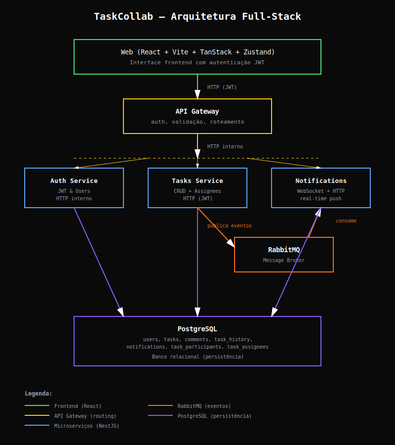
</div>

## 🔑 Componentes

**Web (React + Vite + TanStack + Zustand)** → React + TanStack Router/Query, estilizado com Tailwind e shadcn/ui, consumindo WebSocket e APIs.

**API Gateway** → Ponto único de entrada HTTP; aplica validação JWT, rate-limiting e proxy para os microserviços.

**Auth Service** → Gerencia usuários, hashes de senha, tokens JWT (access + refresh) e fornece `/auth/register`, `/auth/login` e `/auth/refresh`.

**Tasks Service** → CRUD de tarefas, comentários, histórico e publicação de eventos no RabbitMQ (`tasks.events`).

**Notifications Service** → Consome eventos RabbitMQ, mantém WebSocket (WS_PATH `/ws`) e endpoints HTTP para notificações.

**PostgreSQL** → Dados relacionais: usuários, tarefas, comentários, histórico, notificações e participantes.

**RabbitMQ** → Message broker (`tasks.events`) e transportador de eventos com DLX/opções de filas.

## 🔄 Fluxo de Comunicação

1. Cliente → API Gateway (HTTP + JWT)
2. API Gateway → Microserviços internos (tasks, auth, notifications)
3. Serviços → PostgreSQL para persistência transacional
4. Tasks Service → RabbitMQ para eventos e audit logs
5. Notifications Service → Cliente via WebSocket (e polling opcional)

## 🎯 Padrões e Stack Técnica

- **Arquitetura:** Microserviços independentes, com API Gateway orquestrando HTTP + JWT.
- **Comunicação:** REST síncrono entre serviços e fluxo event-driven pelo RabbitMQ; notificações em tempo real via WebSocket.
- **Dev Experience:** Monorepo Turborepo + npm workspaces, TypeScript 5, ESLint e Prettier.
- **Backend:** NestJS com TypeORM , PostgreSQL e Docker Compose.
- **Observabilidade/Ferramentas:** Swagger/OpenAPI no Gateway, DBeaver para inspeção do banco e RabbitMQ (management UI) para mensageria.
- **Frontend:** React + TanStack Router + Tailwind + shadcn/ui.

## 🚀 Como Rodar o Projeto

### 1️⃣ Pré-requisitos

- Docker + Docker Compose
- Node.js 20+ (para scripts locais e migrations)

---

### 2️⃣ Instalação

```bash
npm install
```

---

### 3️⃣ Configurar variáveis (.env)

- Copie cada `.env.example` para `.env` em:
  - `apps/api-gateway`
  - `apps/auth-service`
  - `apps/tasks-service`
  - `apps/notifications-service`
  - `apps/web`
- Alinhe segredos de JWT: use o mesmo `JWT_ACCESS_SECRET` no Gateway e no Notifications (HTTP/WS).
- Ajuste `CORS_ORIGIN` conforme o host do front (ex.: `http://localhost:3000`).
- Em Docker Compose, use os hostnames internos (`auth-service`, `tasks-service`, `notifications-service`, `api-gateway`).

---

### 4️⃣ Subir toda a stack

```bash
docker compose up --build
```

**Serviços expostos:**

| Serviço               | Porta | URL                                  |
| --------------------- | ----- | ------------------------------------ |
| Web (WIP)             | 3000  | http://localhost:3000                |
| API Gateway           | 3001  | http://localhost:3001                |
| Swagger (Gateway)     | —     | http://localhost:3001/api/docs       |
| Health (Gateway)      | —     | http://localhost:3001/api/health     |
| Notifications Service | 3004  | http://localhost:3004                |
| Health (Notifs)       | —     | http://localhost:3004/health         |
| RabbitMQ UI           | 15672 | http://localhost:15672 (admin/admin) |

---

Nota de segurança: os microserviços internos de Auth e Tasks não expõem portas públicas no Docker Compose. A comunicação externa deve ocorrer via API Gateway. Para depuração direta, use `docker compose exec` dentro dos containers ou acesse pelos nomes de host internos da rede do Compose. O Notifications Service expõe a porta 3004 para WebSocket/HTTP.

### 5️⃣ Rodar migrations

Após a stack estar de pé, execute:

```bash
# Auth
docker compose exec auth-service npm run migration:run --workspace=@jungle/auth-service

# Tasks
docker compose exec tasks-service npm run migration:run --workspace=@jungle/tasks-service

# Notifications
docker compose exec notifications-service npm run migration:run --workspace=@jungle/notifications-service

Observação: novas migrations foram adicionadas para padronizar IDs em UUID gerados pelo banco (Auth e Tasks).
Se estiver usando o `docker compose up`, os serviços de Auth e Notifications já estão configurados com `MIGRATIONS_RUN=true` e executam as migrations automaticamente no boot — rode manualmente apenas se estiver trabalhando fora dos containers.
```

---

## 🧭 Jornada de Implementação (Dia a Dia)

As próximas seções documentam, em ordem cronológica, as decisões técnicas, entregas e evidências visuais concluídas em cada etapa do plano.

## 🗓️ DIA 1 – Setup e Infraestrutura

Nesta primeira etapa foi estruturado o **monorepo base** com Turborepo, Docker Compose e configuração das variáveis de ambiente.  
O objetivo foi garantir uma fundação consistente para os serviços backend e o futuro frontend.

### 🧩 Itens configurados

- Estrutura `apps/` e `packages/` padronizada.
- Configurações compartilhadas em `packages/tsconfig`, `eslint-config` e `types`.
- Dockerfiles individuais para cada app (`auth`, `tasks`, `notifications`, `api-gateway`, `web`).
- Arquivo `docker-compose.yml` unificando todos os serviços e dependências (Postgres + RabbitMQ).

### 🖼️ **Figura 1 – Arquitetura inicial da stack**

Diagrama geral mostrando a composição dos serviços e a comunicação via Docker Network.

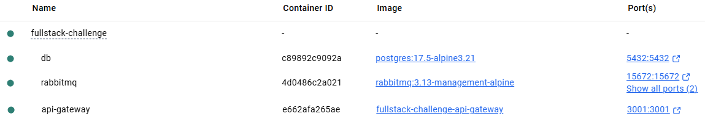

✅ **Resultado:**  
O comando `docker compose up --build` levanta toda a infraestrutura sem erros, incluindo RabbitMQ UI e Postgres DB.

---

## 🗓️ DIA 2 – Auth Service (NestJS + TypeORM + JWT)

Nesta etapa foi implementado o **serviço de autenticação**, responsável pelo cadastro de usuários, login e renovação de tokens (refresh).  
A implementação garante segurança de credenciais com hash de senha (`bcrypt`) e autenticação baseada em **JWT (JSON Web Token)**.

### 🧩 Funcionalidades principais

- Entidade `User` com senha criptografada via **bcrypt**.
- Endpoints principais:
  - `POST /auth/register` — cria novo usuário.
  - `POST /auth/login` — autentica e retorna tokens JWT.
  - `POST /auth/refresh` — renova o access token.
- Geração e validação de tokens **JWT (access + refresh)**.
- Migrations automáticas habilitadas com `MIGRATIONS_RUN=true`.

---

### 🖼️ **Figura 2 – Swagger (Auth Service – Dia 2)**

Endpoints de autenticação documentados e testáveis via Swagger.  
Demonstra o módulo de autenticação implementado no **Auth Service**, acessível também via **API Gateway**.

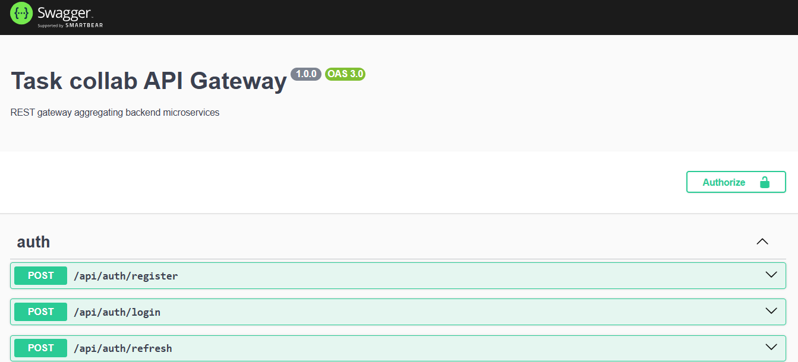

---

### 🖼️ **Figura 3 – Resposta do registro (JWT emitido – Dia 2)**

Execução bem-sucedida do endpoint `POST /api/auth/register`, retornando **código 201 Created** e tokens JWT válidos.  
Comprova a integração completa entre **Gateway → Auth Service → Banco PostgreSQL**.

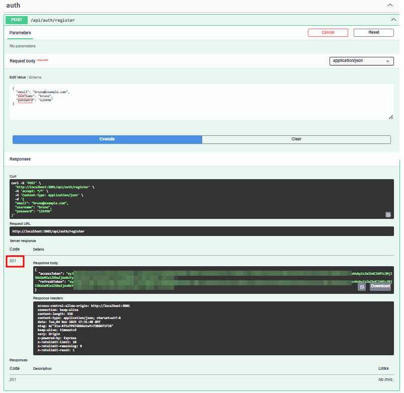

---

✅ **Resultado:**  
Usuários podem se registrar, autenticar e renovar tokens de acesso com segurança.  
Fluxo totalmente validado via **Swagger UI** (`http://localhost:3001/api/docs`).

---

## 🗓️ DIA 3 – API Gateway

Nesta etapa foi desenvolvido o **API Gateway**, responsável por centralizar todas as requisições externas e aplicar regras globais de autenticação e segurança.  
O Gateway atua como ponto único de entrada para o front-end e para clientes externos, encaminhando as requisições para os microserviços internos (`auth-service`, `tasks-service` e posteriormente `notifications-service`).

### 🧩 Funcionalidades implementadas

- **Proxy reverso** das rotas:
  - `/api/auth/*` → `auth-service`
  - `/api/tasks/*` → `tasks-service`
- **Guards JWT globais**, garantindo acesso apenas a usuários autenticados.
- **Rate limiting** configurado (10 requisições por segundo) para evitar abuso.
- **Configuração de CORS** para permitir origens seguras (ex.: `http://localhost:3000`).
- **Documentação Swagger unificada** em `/api/docs`, consolidando os endpoints públicos.

---

### 🖼️ **Figura 4 – Swagger consolidado (Gateway – Dia 3)**

Documentação unificada exibindo os módulos `auth`, `tasks` e `health` acessíveis por uma única porta (`3001`).  
Demonstra a agregação dos microserviços e a centralização do acesso via **API Gateway**.


---

✅ **Resultado:**  
Fluxo completo de autenticação e tarefas funcionando através do **API Gateway**.  
As rotas internas (`auth-service`, `tasks-service`) passam a ser acessadas de forma segura e centralizada em:  
👉 **`http://localhost:3001/api/docs`**

---

## 🗓️ DIA 4 – Estrutura Base (Tasks Service)

Nesta etapa foi implementado o **Tasks Service (Parte 1)**, responsável pelo CRUD completo de tarefas e pela integração com usuários via `task_assignees`.  
O foco principal foi consolidar o backend com migrations, relacionamentos e validações de dados.

### 🧩 Funcionalidades implementadas

- Entidade `Task` com campos `title`, `description`, `status`, `priority`, `createdAt`, `updatedAt`.
- Relacionamentos:
  - `users` ↔ `tasks` (um para muitos)
  - `tasks` ↔ `task_assignees` (muitos-para-muitos)
- Endpoints:
  - `GET /api/tasks`
  - `POST /api/tasks`
  - `GET /api/tasks/{id}`
  - `PUT /api/tasks/{id}`
  - `DELETE /api/tasks/{id}`
- Migrations automáticas com `uuid_generate_v4()` habilitado.
- Validações TypeORM e `ParseUUIDPipe`.

---

### 🖼️ **Figura 6 – ER Diagram (Dia 4)**

Diagrama Entidade-Relacionamento (ER) gerado no DBeaver, mostrando as relações entre `users`, `tasks` e `task_assignees`.  
Evidencia a estrutura inicial do banco antes da inclusão de comentários e histórico.

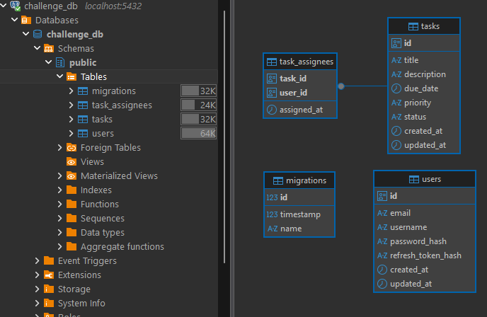

---

✅ **Resultado:**  
CRUD de tarefas funcional e banco de dados consolidado com relacionamentos básicos.  
Este módulo passou a servir como núcleo para os eventos e notificações adicionados nas etapas seguintes.

---

## 🗓️ DIA 5 – Comentários, Histórico e Eventos

Nesta etapa o **Tasks Service** foi expandido para incluir o registro de **comentários** e **histórico de eventos**, além da **publicação de mensagens no RabbitMQ**.  
Essas adições permitiram rastrear mudanças nas tarefas e emitir notificações assíncronas para outros serviços.

### 🧩 Funcionalidades implementadas

- Novas entidades:
  - `Comment` — associa usuários e tarefas via `authorId` e `taskId`.
  - `TaskHistory` — registra eventos `TASK_CREATED`, `TASK_UPDATED`, `COMMENT_CREATED`.
- Publicação de eventos RabbitMQ (`task.created`, `task.updated`, `task.comment.created`).
- Transações TypeORM garantindo consistência entre `tasks`, `comments` e `task_history`.
- Payloads padronizados (`actorId`, `timestamp`, `type`).

---

### 🖼️ **Figura 7 – Swagger (Dia 5 – Comments)**

Swagger atualizado exibindo os novos endpoints de comentários (`GET` e `POST /api/tasks/{id}/comments`), integrados ao módulo `Tasks`.  
Demonstra a evolução da API com suporte a interações e auditoria.

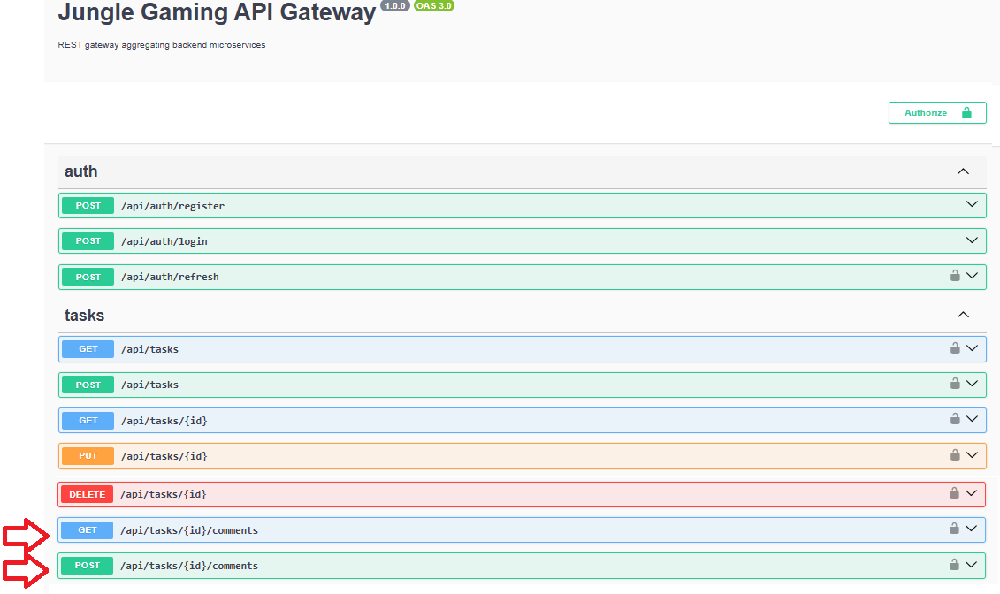

---

### 🖼️ **Figura 8 – Estrutura de banco (Dia 5)**

Novas tabelas `comments` e `task_history` adicionadas ao schema do PostgreSQL (`challenge_db`).  
Evidenciam a expansão da modelagem para suportar interações e logs de eventos.

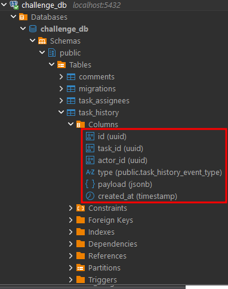

---

## 🗓️ DIA 6 – Notifications Service (Mensageria e WebSocket)

Nesta etapa foi implementado o **serviço de notificações em tempo real**, consumindo os eventos publicados pelo `tasks-service` via RabbitMQ e emitindo atualizações via WebSocket.

### 🧩 Principais avanços

- Configuração do **consumer RabbitMQ** (`notifications.q`) com bindings `task.#`.
- Persistência de notificações e participantes (`notifications`, `task_participants`).
- Implementação de **WebSocket Gateway** com autenticação JWT no handshake.
- Emissão de eventos `task:created`, `task:updated` e `comment:new`.

---

### 🖼️ **Figura 11 – RabbitMQ UI (Dia 6)**

Interface do RabbitMQ exibindo o _exchange_ `tasks.events` do tipo **topic**, com a fila `notifications.q` vinculada através do _binding key_ `task.#`.  
Esse mapeamento garante que todos os eventos publicados pelo **Tasks Service** (`task.created`, `task.updated`, `task.comment.created`) sejam roteados para o **Notifications Service**, responsável por consumi-los e emitir notificações em tempo real via WebSocket.

O gráfico confirma a publicação e o consumo imediato dos eventos — evidenciando a comunicação assíncrona entre microserviços.

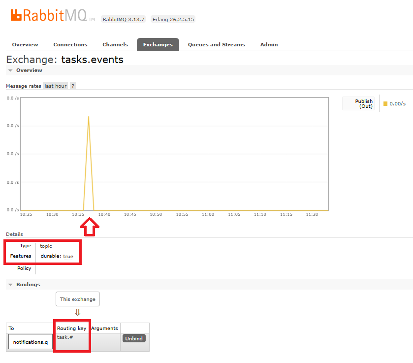

---

### 🖼️ **Figura 12 – Estrutura do banco (Dia 6)**

Tabelas `notifications` e `task_participants` adicionadas ao schema, responsáveis por armazenar destinatários e notificações pendentes.

## 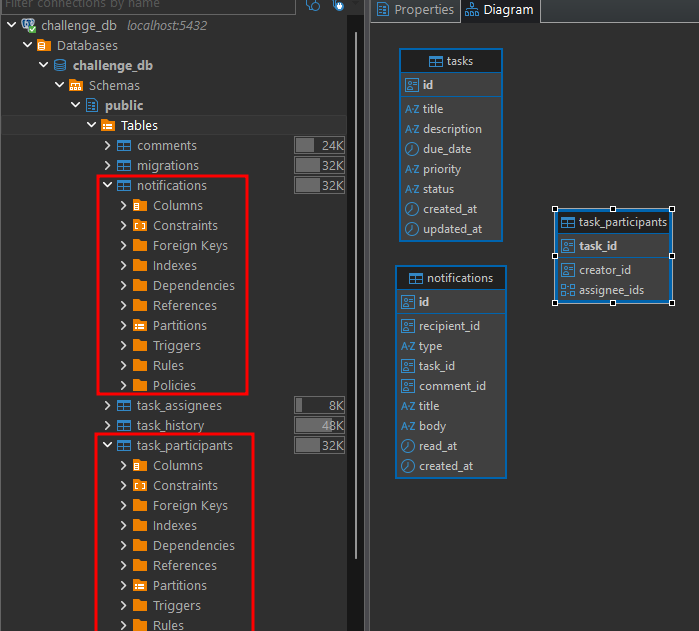

### 🖼️ **Figura 13 – WebSocket conectado (Dia 6)**

Captura do console com a conexão WebSocket autenticada (`ws://localhost:3004/ws?token=<JWT>`).

## 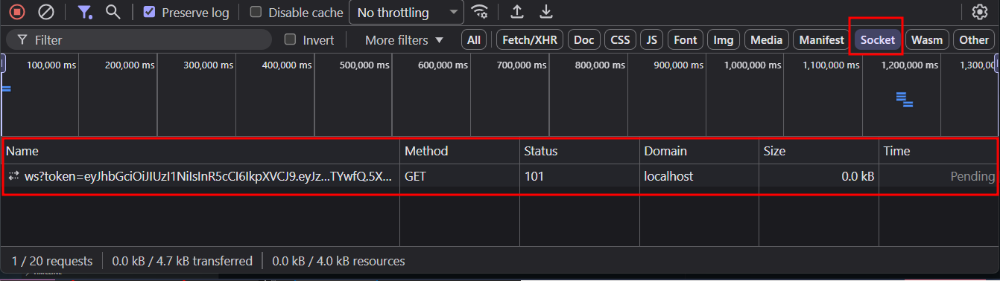

## 🗓️ DIA 7 – Frontend (Setup + Auth)

Nesta etapa foi criada a aplicação React em `apps/web` com autenticação integrada ao API Gateway.  
O front-end foi configurado com **Vite + React + TypeScript**, **Tailwind CSS**, **shadcn/ui**, **TanStack Router** e **Zustand** para gerenciamento de estado global e persistência de sessão.

### 🧩 Fluxo Validado

1. Usuário acessa `/register` e preenche o formulário.
2. O front envia `POST /api/auth/register` via Gateway.
3. O Auth Service responde com tokens JWT (`accessToken` e `refreshToken`).
4. O Zustand salva o estado em `localStorage` e o usuário é redirecionado para a área autenticada.

---

### 🖼️ **Figura 14 – Tela de Registro**

Interface `/register` com o formulário preenchido antes do envio.  
_Mostra o app React rodando localmente e o layout base configurado._

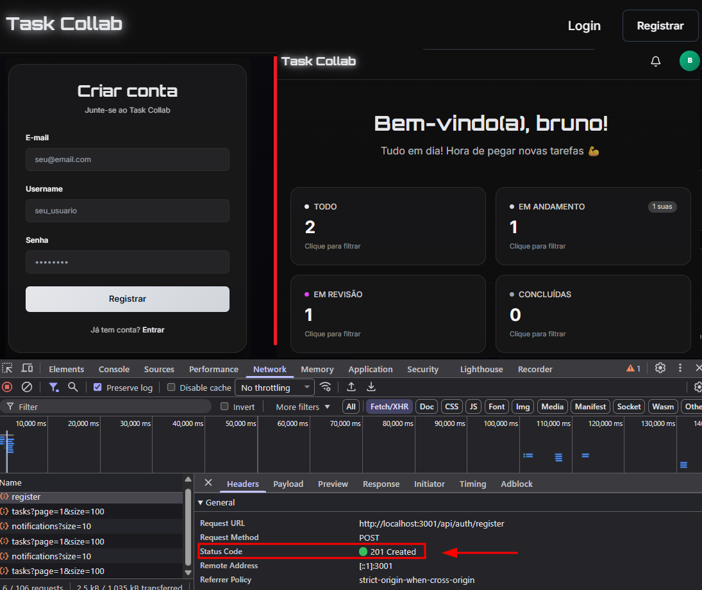

---

### 🖼️ **Figura 15 – Resposta e persistência Zustand**

Resposta do Auth Service e dados salvos em `localStorage`, comprovando autenticação e persistência da sessão.

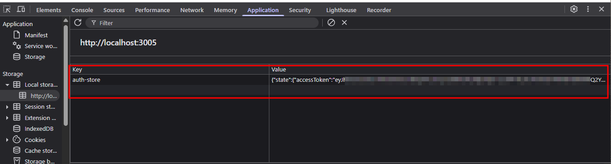

---

✅ **Resultado:**  
Login e registro funcionando via API Gateway, tokens persistindo localmente e rotas privadas protegidas.  
O frontend está pronto para iniciar o **Dia 8 – Tasks List + Comments**.

---

## 🗓️ DIA 8 – Frontend (Tasks List + Comments)

Nesta etapa foram implementadas as telas de **listagem, edição, exclusão e detalhamento de tarefas**, além da **seção de comentários** com integração direta à API (`/api/tasks` e `/api/tasks/:id/comments`).

### 🧩 Recursos implementados

- Integração com **TanStack Query** para cache e revalidação automática.
- Tabela responsiva usando **shadcn/ui Table**.
- Páginas: `/tasks` (listagem) e `/tasks/:id` (detalhe).
- Formulários com validação (`react-hook-form` + `zod`).
- Toasts de feedback e estados “empty” e “loading”.

---

### 🖼️ **Figura 16 – Lista de tarefas (Dia 8)**

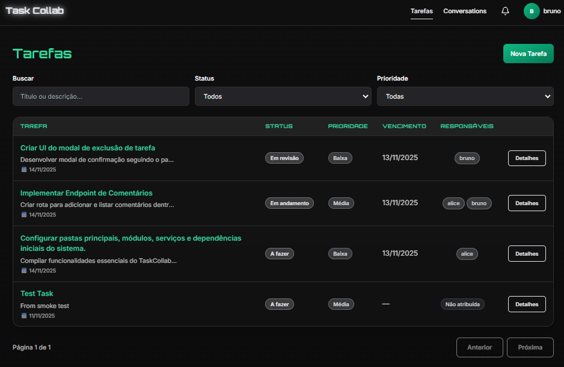

---

### 🖼️ **Figura 17 – Detalhe da tarefa e comentários**

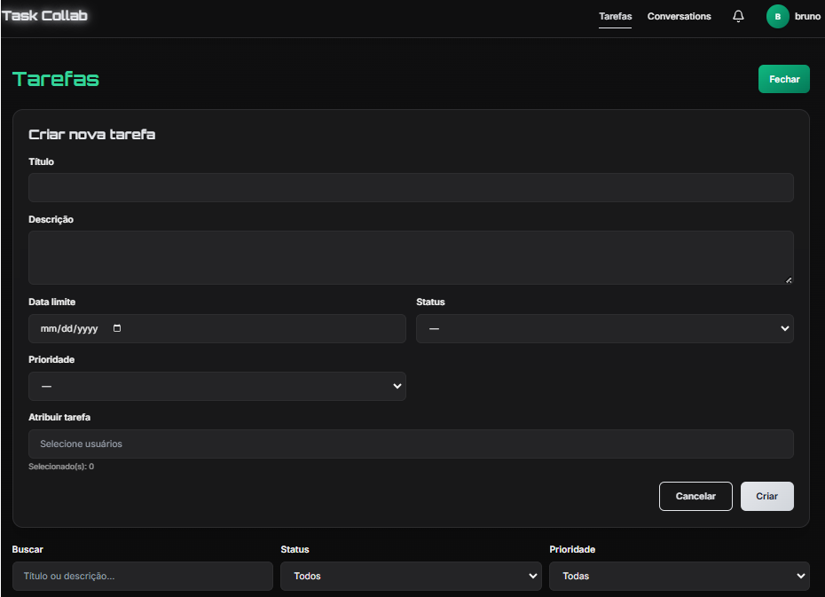

---

✅ **Resultado:**  
CRUD visual completo de tarefas e comentários, funcionando de ponta a ponta via API Gateway.

---

## 🗓️ DIA 9 – Frontend (WebSocket + UX)

Nesta etapa o frontend passou a receber **notificações em tempo real** via **WebSocket**, exibindo toasts imediatos e um **centro de notificações sincronizado**.  
O objetivo foi consolidar a integração entre o **Notifications Service**, o **API Gateway** e o **cliente React**, garantindo comunicação bidirecional e experiência fluida entre usuários simultâneos.

### 🖼️ **Figura 18 – Notificações em tempo real (Dia 9)**


Interface exibindo o recebimento de **notificações em tempo real** via WebSocket.  
O ícone de sino indica o **contador de novas notificações (“2”)**, enquanto o dropdown mostra os detalhes de cada evento — título, participantes e horário da criação.  
Essa captura demonstra a sincronização imediata entre **Notifications Service**, **API Gateway** e **frontend React**, confirmando o funcionamento completo dos eventos `task:created`, `task:updated` e `comment:new`.

---

✅ **Resultado:**  
Notificações instantâneas entre usuários, com **atualização dinâmica**, **persistência sincronizada** e **feedback visual em tempo real**, validando o fluxo completo entre **backend e frontend**.  
Essa etapa consolida o comportamento colaborativo do sistema e encerra a integração total da stack full-stack.

---

## 🗓️ DIA 10 – Frontend (Testes Finais)

Nesta etapa o objetivo foi **realizar os testes finais de qualidade, confirmar a integridade da stack completa e validar a arquitetura full-stack em execução via Docker Compose**.  
Todos os serviços foram inspecionados individualmente (Auth, Tasks, Notifications, API Gateway, RabbitMQ, Postgres e Web), garantindo comunicação estável, build limpo e notificações em tempo real entre usuários.

Durante os testes de QA, foram executados:

- 🧱 **Build global (`turbo run build`)** — todos os pacotes compilaram com sucesso.
- 🩺 **Health checks internos** — confirmaram status `ok` para `tasks-service` e `notifications-service` dentro da rede Docker.
- 🧩 **Fluxo E2E completo** — Login → Criação de tarefa → Comentário → Notificação em tempo real → Sincronização via WebSocket.
- 🐇 **Mensageria RabbitMQ validada** — eventos publicados no exchange `tasks.events` e consumidos por `notifications.q`.
- 🌐 **Frontend e Gateway** — conectados corretamente, exibindo toasts, badges e lista de notificações atualizadas em tempo real.

---

### 🧩 MCP Servers (Context7)

Este projeto utiliza MCP (Model Context Protocol) na configuração do IDE/agent para melhorar a produtividade durante o desenvolvimento.
